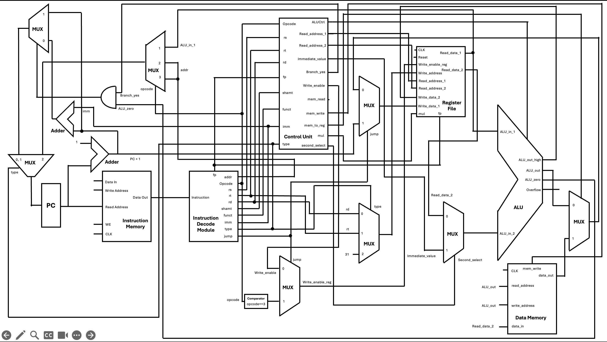

# **MiniMIPS-X**  

This repository contains a Verilog implementation of a MIPS based processor which supports a subset of instructions based on the MIPS ISA, with custom instruction encodings. This project was done as a course project for the course CS220: Computer Organisation, under Prof. Debapriya Roy, IIT Kanpur.

## **Components and Modules**  

- **Instruction Decode Module**  
  - Decodes the values (opcode, rs, rt, rt, shamt, funct, imm, addr) from a 32-bit instruction.

- **Register File**  
  - Contains 32 general purpose, and 32 floating point registers, similar to MIPS
  - Registers that have been changed are $26, $27 in GPR (which are being used for HI, LO instead of k0, k1), and $32 in FPR (which is being used as cc flag)

- **Control Unit**  
  - A combinatorial block which decides inputs for the ALU/other operations. 

- **Arithmetic and Logic Unit (ALU)**  
  - Responsible for performing arithmetic and logical operations. 
  - Can perform both integer and floating point operations based on the instruction.

- **Instruction and Data Memories**  
  - Simple Implementations for memories using arrays of 32 bit registers.
  - These can also be implemented using Distributed Memories for more efficient implementation.

## **Getting Started**  

### **Requirements**  
- Verilog simulator (e.g., **ModelSim, Icarus Verilog**)  
- FPGA synthesis tool (e.g., **Vivado, Quartus, Yosys**)  

### **Simulation & Testing**  

1. Run `processor.v` with its testbench `processor_tb.v`. The testbench is loaded with instruction encodings for **Bubble Sort**. You can try and run other algorithms (encoding each instruction can be painful for longer programs).

### **Schematic**  

A diagram showing the entire implementation is shown below.

     

  
  <!-- 
   -->

### **Feedback**  

Feel free to reach out or initiate a pull request if you find any issues!

